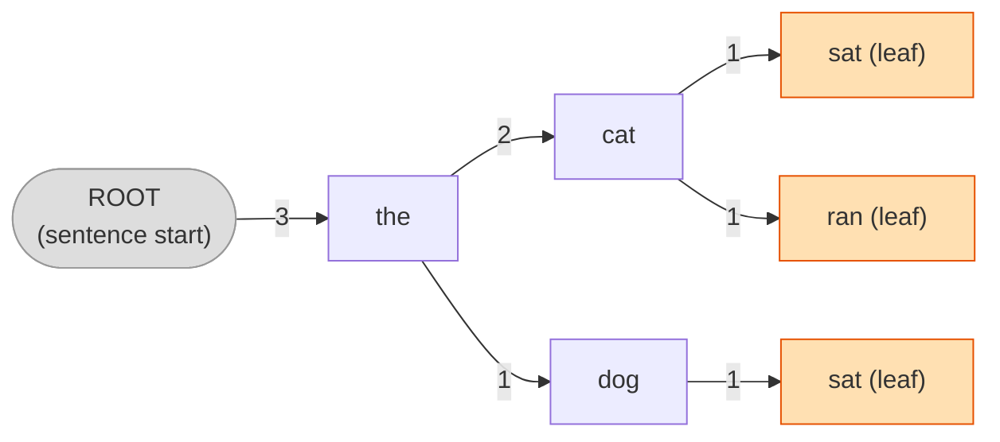

# FakeSentences

Generates plausible-sounding nonsense sentences by training a Markov chain on any plain-text corpus.

Words are stored as nodes in a weighted directed graph. Each node tracks how often one word follows another, and whether the word ever ended a sentence in the training data (`IsLeaf`, `IsNotLeaf`, or `IsMaybeLeaf`). Sentences are generated by walking the graph from a random starting word, choosing each next word weighted by frequency, and stopping at leaf nodes or probabilistically at maybe-leaf nodes.

## Requirements

- [.NET 10 SDK](https://dotnet.microsoft.com/download)

## Building

```bash
dotnet build FakeSentences.sln
```

## Running

```bash
dotnet run --project FakeSentences/FakeSentences.csproj
```

The app prompts for one or more plain-text files to train on, then generates sentences from the combined graph. Two Project Gutenberg texts are included:

| File | Contents |
|------|----------|
| `FakeSentences/pg11.txt` | *Alice's Adventures in Wonderland* — Lewis Carroll |
| `FakeSentences/pg2591.txt` | *Grimms' Fairy Tales* — Brothers Grimm |

## How it works

Training on three sentences — `"The cat sat."`, `"The cat ran."`, `"The dog sat."` — builds this graph:



Edge weights are counts. **(leaf)** marks **leaf nodes** — words that ended a sentence in training. A word seen both mid-sentence and at the end becomes a **maybe-leaf** and generation stops there with 50% probability, producing shorter and more varied output.

Multiple files train into the same graph — edges from later files simply increment counts on existing nodes, so word-pair frequencies blend across all corpora.

To generate a sentence the program:

1. Picks a starting word from `ROOT`'s children, weighted by count
2. Follows edges to the next word, weighted by count
3. Stops at a leaf, or probabilistically at a maybe-leaf

## Sample run

Training on both included texts (*Alice in Wonderland* + *Grimms' Fairy Tales*):

```text
Enter training files one per line, then press Enter to start:
FakeSentences/pg11.txt
  -> 'FakeSentences/pg11.txt'
Whole file was read!
Done processing training data
FakeSentences/pg2591.txt
  -> 'FakeSentences/pg2591.txt'
Whole file was read!
Done processing training data

Top 5 most common sentence starting words:
  1: the             (3608)
  2: and             (1525)
  3: a               (992)
  4: he              (941)
  5: you             (745)
The the owner of when the quicker she would that and when the the king the forest. You the father. The workmanship there you as the the dwarf and on the the king the wand and at the the sun. As what you but give the the other. Many a copy a dormouse was sitting between them fast asleep and a piece.
```

## Running tests

```bash
dotnet test FakeSentences.Tests/FakeSentences.Tests.csproj
```
